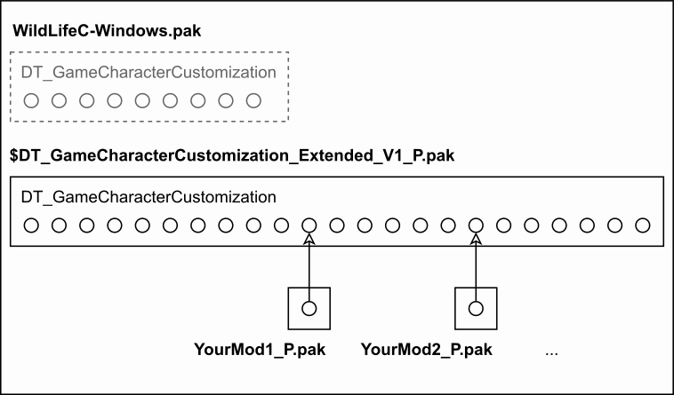

# Wild Life Mod: GameCharacterCustomizationExtended

This is a mod for Wild Life that extends the character customization options as follows:

* Adds 100 blank slots for each character's skin/eyeliner/eyeshadow/lipstick style.
* Adds most of Max's hair styles to Maya-based characters.
* Adds some of Maya's hair styles to Max-based characters.

## ⚠️ Compatibility


**2023.12.14_Shipping_Full_Build_1**

The file `$DT_GameCharacterCustomization_Extended_V1_P.pak` is made for the above build and should **only** be used with this build!

When a new Wild Life build arrives, I will try to make a new version of the mod that works with that build.

## 👉 Install

To install the mod, download the file `$DT_GameCharacterCustomization_Extended_V1_P.pak` to the following directory:

```
C:\Path\To\2023.12.14_Shipping_Full_Build_1\Windows\WildLifeC\Content\Paks
```

Don't change the file's name: The dollar symbol is put at the front to ensure that the file comes early in the sort order so that its blank slots can easily be overridden by texture mods.

## 👈 Uninstall

To uninstall the mod, remove the file `$DT_GameCharacterCustomization_Extended_V1_P.pak` from the following directory:

```
C:\Path\To\2023.12.14_Shipping_Full_Build_1\Windows\WildLifeC\Content\Paks
```

## 🎨 For texture modders

You can override any of the blank slots in this mod the same way you override a built-in texture; just target `$DT_GameCharacterCustomization_Extended_V1_P.pak` instead of `WildLifeC-Windows.pak`.

(If you're new to texture modding, you can find a guide here: https://wlx.neocities.org/guides/textures/)

Don't worry about each blank slot just being a 32x32 placeholder image; you are going to override it anyway! 😉 (The resolution of the placeholder image doesn't matter; only its path matters.)

The image below shows the idea behind the mod:


